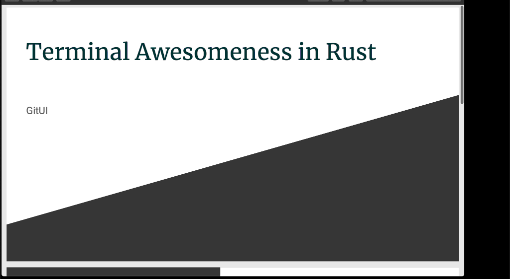

# gitui-presentation
retro terminal presentation of [gitui](https://github.com/extrawurst/gitui) at @RustBerlin meetup May 2020:

## youtube
[](https://www.youtube.com/watch?v=2LPWasX16O8&t=6090)

## slides as a gif


The presentation uses [presentui](https://github.com/extrawurst/presentui) which I wrote specificly for it.

run in terminal:
```
presentui -f slides.ron
```